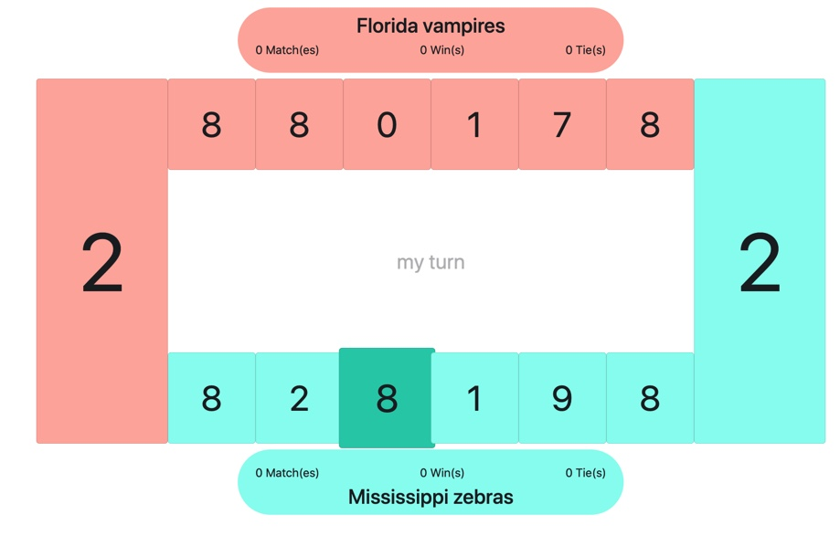
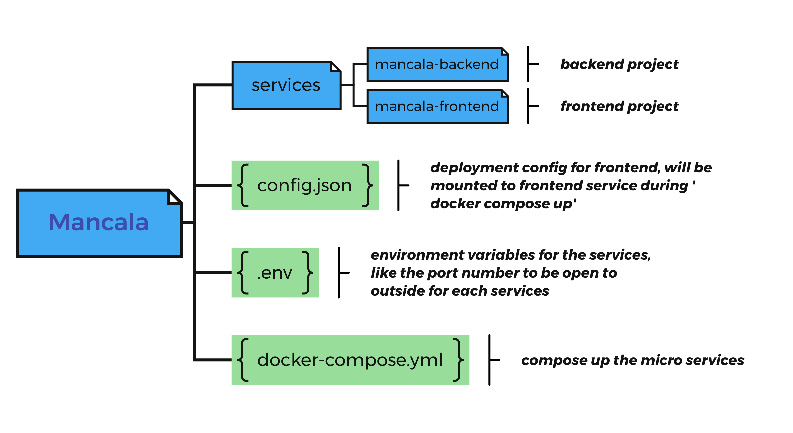
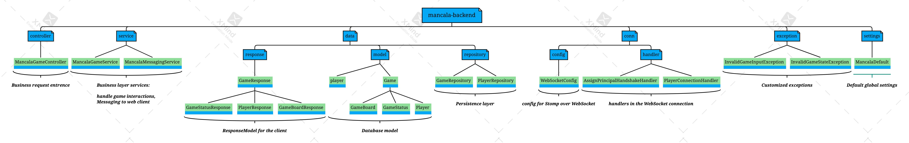
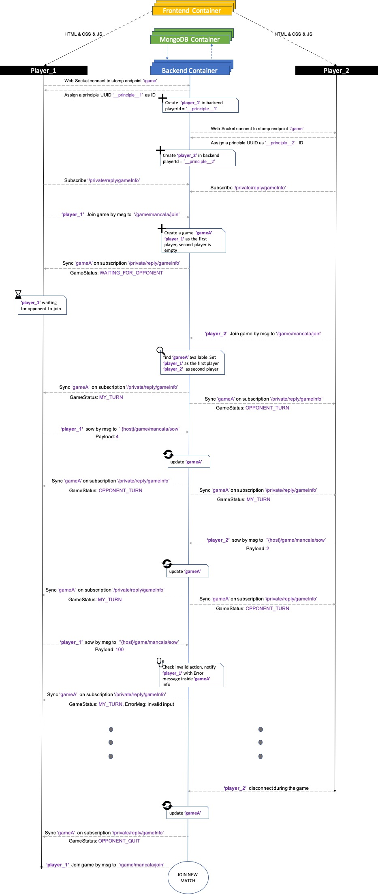

# **[ My entrance code challenge of Bol.com ]**
___
# Abstract
1. This is a fullstack implementation of Game Mancala.

2. The server supports multiple players online. Player is able to match with an opponent in real time. 

4. Check [Easy Set Up](#easy-set-up) to easily set it up on your local or remote server.


### Tech stacks:
  - Frontend: ***Angular 13***
  - Backend: ***Spring Boot***
    - Full duplex communication: **Stomp over WebSocket**
    - Testing: **Junit5** and **Mockito**
  - Deployment: ***Docker Compose***
 

> **Websocket** makes the game easy and fun for all players are in realtime interaction. 
> 
> **Junit5** and **Mockito** make testing fun ~
> 
> **Docker Compose** makes deployment easy ~

###
> *For people who might not know what Mancala is, please check [Mancala Rules](https://www.youtube.com/watch?v=OX7rj93m6o8)*


# Easy Set Up
 
- [ ] 1. install docker, [get docker here](https://docs.docker.com/get-docker/)
- [ ] 2. checkout the latest branch and go into the project root folder
- [ ] 3. update ./config.json file, replace the {{server.ip}} to your local/server ip
    ```json
     {
     "endpoint": "http://{{server.ip}}:8080/game",
     "gameInfoBroker": "/private/reply/gameInfo",
     "sowDestPrefix": "/mancala/sow",
     "joinDestPrefix": "/mancala/join"
     }
    ```
- [ ] 4. just run 'docker compose up' (first time may take longer because of images pulling) and everything will be set
    ```
    docker compose up -d
    ``` 
- [ ] 5. open browser and hit http://{{server.ip}}:9000, invite friend do the same so you two can match together.
> *In case no accompany during Covid time, hit http://{{server.ip}}:9000 on another browser tab,
> so at least this game can accompany you for a while ;)*

If everything goes well, you should be playing a game like this:
- you will match with real time players
- you are belonged to the light green side (bottom)
- every player has a random team name
- every player has a score record
- every time you connect to the server, you will have a brand-new Identity (easy come easy go, no pressure)
- follow the game instructions and have fun!



You can also change default port by editing 'BACKEND_LOCAL_PORT' and 'FRONTEND_LOCAL_PORT' in .env file:\
Please don't update the other ones.
>'BACKEND_LOCAL_PORT': the port backend service used,
> if you update here please also update the config.json port
> 
>'FRONTEND_LOCAL_PORT': the port that you can access by browser.

```lombok.config
MONGO_LOCAL_PORT=27017
MONGO_DOCKER_PORT=27017

BACKEND_LOCAL_PORT=8080
BACKEND_DOCKER_PORT=8080

FRONTEND_LOCAL_PORT=9000
FRONTEND_DOCKER_PORT=80
```

# Project Overview
Here is an over all view of the project structure:
> Because only one git repository is provided, so here backend and frontend services are together in the same
> repository under 'services'
>
> More general case is for each service create one repository
> and create another repository for the services' deployment
> 
> then check out all the services under 'services' folder in the deployment repository.



This is the structure of the backend project:



# Work Flow
Basically The communication part is using Spring STOMP over WebSocket for full duplex communication.


Here is a work flow of how the services interact with each other:




# Game Status
In this project, there are two sets of game status, one is to the server, the other set is to the player.
The reason is that it is better to understand and maintain the status for each role.

For each game,\
to the server(judge), it is 'firstPlayer' and 'secondPlayer'.\
to the player, it is 'me' and 'opponent'.

### Game status in the server side
```lombok.config
PENDING: game is created but first player is waiting

ONGOING_P1: game is ongoing, first player's turn

ONGOING_P2: game is ongoing, second player's turn

FINISHED_CANCEL: game is canceled

FINISHED_QUIT_P1: game is over, first player quit

FINISHED_QUIT_P2: game is over, second player quit

FINISHED_WON_P1: game is over, first player won

FINISHED_WON_P2: game is over, second player won

FINISHED_TIE: game is over, game is a tie
```

### Game status in the player(client) side
```lombok.config
WAITING_FOR_OPPONENT: I am waiting for opponent

MY_TURN: it is my turn

OPPONENT_TURN: opponent's turn

I_QUIT: I quit

OPPONENT_QUIT: opponent quits

CANCEL: game is canceled

WIN: I win

LOSE: I lose

TIE: it is a tie game
```
    
